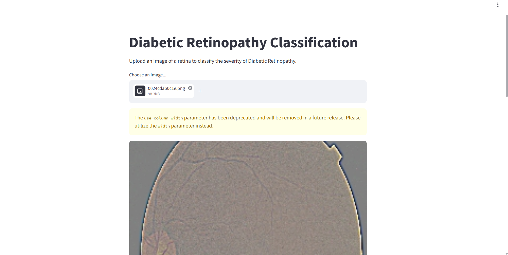

<div align="center">

# 👁️ Diabetic Retinopathy Detection using Deep Learning

### AI-Powered Early Detection of Diabetic Retinopathy from Retinal Fundus Images

<p align="center">


</p>

---

## 📸 Project Demo

> **Replace these images with your screenshots**

<p align="center">



<br><br>


</p>

---

# 📖 Overview

Diabetic Retinopathy (DR) is one of the leading causes of blindness among diabetic patients. Early diagnosis through retinal fundus image analysis can prevent permanent vision loss.

This project develops a **Deep Learning-based Computer Vision System** capable of classifying retinal fundus images into five stages of Diabetic Retinopathy using **Convolutional Neural Networks (CNNs)**.

The trained model is deployed through a **Streamlit Web Application**, enabling users to upload retinal images and receive real-time predictions.

---

# 🚀 Features

✅ Automatic Image Preprocessing

✅ Deep Learning Classification

✅ Five-Class DR Prediction

✅ Interactive Streamlit Web App

✅ Model Performance Visualization

✅ Google Colab Compatible

✅ TensorFlow SavedModel Export

✅ Easy Deployment

---

# 🩺 Disease Classification

| Stage | Description |
|---------|-------------|
| 🟢 No_DR | Healthy Retina |
| 🟡 Mild | Mild Diabetic Retinopathy |
| 🟠 Moderate | Moderate Diabetic Retinopathy |
| 🔴 Severe | Severe Diabetic Retinopathy |
| ⚫ Proliferate_DR | Proliferative Diabetic Retinopathy |

---

# 🏗 Project Architecture

```text
                    Retinal Fundus Images
                             │
                             ▼
                 Image Preprocessing
                             │
                             ▼
                    Image Resizing
                             │
                             ▼
                  Data Normalization
                             │
                             ▼
                 CNN Deep Learning Model
                             │
                             ▼
               Softmax Classification Layer
                             │
                             ▼
          Diabetic Retinopathy Prediction
                             │
                             ▼
              Streamlit Web Deployment
```

---

# 🧠 Model Architecture

```
Input Layer

↓

Conv2D + ReLU

↓

MaxPooling

↓

Batch Normalization

↓

Conv2D + ReLU

↓

MaxPooling

↓

Dropout

↓

Flatten

↓

Dense Layer

↓

Dropout

↓

Output Layer (Softmax)
```

---

# 📂 Dataset

| Property | Details |
|----------|----------|
| Dataset | Diabetic Retinopathy Detection |
| Image Size | 224 × 224 |
| Classes | 5 |
| Source | Kaggle |
| Format | JPG |

---

# 🛠 Technologies Used

| Technology | Purpose |
|------------|---------|
| Python | Programming |
| TensorFlow | Deep Learning |
| Keras | CNN Development |
| NumPy | Numerical Computing |
| Pandas | Data Analysis |
| Matplotlib | Visualization |
| Pillow | Image Processing |
| Streamlit | Deployment |
| Google Colab | Model Training |

---

# 📊 Training Pipeline

```
Dataset Collection
        │
        ▼
Data Cleaning
        │
        ▼
Image Preprocessing
        │
        ▼
CNN Model Building
        │
        ▼
Model Training
        │
        ▼
Validation
        │
        ▼
Evaluation
        │
        ▼
Model Saving
        │
        ▼
Streamlit Deployment
```

---

# 💻 Streamlit Application

### Users can

- 📤 Upload retinal fundus image
- 👁 Preview uploaded image
- 🤖 Predict disease severity
- 📊 View prediction confidence
- ⚡ Get instant results

---

# 📁 Project Structure

```
Diabetic-Retinopathy-Detection/
│
├── dataset/
├── notebooks/
│     └── Diabetic_Retinopathy_Detection.ipynb
│
├── models/
│     └── saved_model/
│
├── app.py
├── requirements.txt
├── README.md
└── images/
      ├── home.png
      └── prediction.png
```

---

# 📈 Future Improvements

- 🚀 Transfer Learning (EfficientNet)
- 📈 Hyperparameter Tuning
- 🔥 Grad-CAM Explainability
- ☁ Cloud Deployment
- 📱 Mobile Application
- 🏥 Clinical Decision Support
- 🌐 REST API Integration

---

# 🎯 Applications

🏥 Hospitals

👨‍⚕️ Eye Clinics

🌍 Telemedicine

🩺 Medical Screening

🔬 Healthcare Research

🤖 AI-assisted Diagnosis

---

# 🤝 Contributing

Contributions are always welcome!

1. Fork the Repository
2. Create a New Branch
3. Commit Your Changes
4. Push to Your Branch
5. Open a Pull Request

---

# 👨‍💻 Author

## **P. Aravind**

**AI & Data Science Student**

💡 Deep Learning • Computer Vision • Healthcare AI • Data Science

---

<div align="center">

## ⭐ If you found this project useful, don't forget to Star the repository!

Made with ❤️ by **P. Aravind**

</div>
